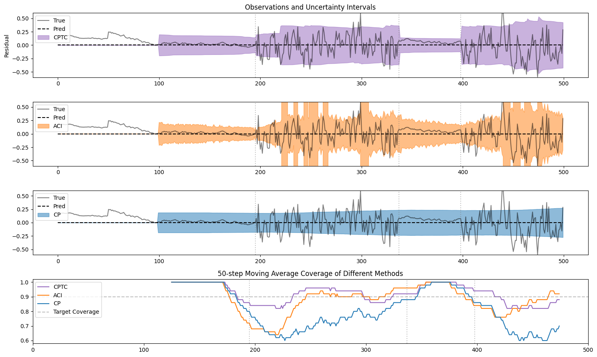

# Conformal Prediction for Time-series with Change points (CPTC)

This repository contains the official implementation of **"Conformal Prediction for Time-series Forecasting with Change Points"** (NeurIPS 2025).

[Paper](https://arxiv.org/abs/2509.02844)

---

## Abstract

Conformal prediction has been explored as a general and efficient way to provide uncertainty quantification for time series. However, current methods struggle to handle time series data with change points — sudden shifts in the underlying data-generating process. In this paper, we propose a novel **Conformal Prediction for Time-series with Change points (CPTC)** algorithm, addressing this gap by integrating a model to predict the underlying state with online conformal prediction to model uncertainties in non-stationary time series. We prove CPTC's validity and improved adaptivity in the time series setting under minimum assumptions, and demonstrate CPTC's practical effectiveness on 6 synthetic and real-world datasets, showing improved validity and adaptivity compared to state-of-the-art baselines.

---

## Key Features

- **State-aware conformal prediction**: Leverages underlying state information in switching dynamics systems
- **Theoretical guarantees**: Ensures validity without assumptions on time-series stationarity or accurate state predictions
- **Improved adaptivity**: Rapidly adapts to distributional shifts, especially effective on short to medium-length time series
- **Robust coverage**: Maintains target coverage under change points and non-stationarity

<p align="center">
  
</p>

---

## Setup

1. Clone this repository:
```bash
git clone https://github.com/yourusername/CPTC.git
cd CPTC
```

2. Create a virtual environment (recommended):
```bash
conda create -n cptc python=3.8
conda activate cptc
```

3. Install dependencies:
```bash
pip install -r requirements.txt
```


---


## Quick Start

### Running All Baselines

To reproduce the experiments from the paper, run:

```bash
python run_all_baselines.py --methods REDSDS CP ACI CPTC AgACI DtACI MVP
```

This will:
1. Run all specified methods on all 6 datasets
2. Compute coverage and interval width metrics
3. Save results to `results/`

### Generate Results Table

After running experiments, generate a comparison table:

```bash
python run_all_baselines.py --load-results --results-dir results --output-csv my_results.csv
```

This creates a CSV file with coverage and width statistics for all methods across all datasets.

### Available Methods

- **RED-SDS**: Base probabilistic model (Recurrent Explicit Duration Switching Dynamical System) - provides state predictions and per-state forecasts
- **CP**: Standard Conformal Prediction
- **ACI**: Adaptive Conformal Inference
- **AgACI**: Aggregated Adaptive Conformal Inference
- **DtACI**: Distribution-free Time-series Adaptive Conformal Inference
- **MVP**: Multi-Valid Prediction
- **CPTC**: Our proposed method (Conformal Prediction for Time-series with Change points)

Other baselines reported in the paper such as HopCPT and ECI were ran directly using the method's open sourced codebase. SPCI is included in this repository, but requires a different environment setup to run. Please see their original repository for instructions.


---

## Datasets

The repository includes 6 datasets (3 synthetic, 3 real-world). We include the inference result of trained Switching Dynamic Systems model from the [REDSDS repository](https://github.com/abdulfatir/REDSDS).


1. **Bouncing Ball (Observation Noise)** (`bouncing_ball_obs.npz`): Simulated bouncing ball with observation noise 
2. **Bouncing Ball (Dynamics Noise)** (`bouncing_ball_dyn.npz`): Simulated bouncing ball with dynamics noise
3. **3-Mode System** (`3_mode_system.npz`): Switching system with three distinct dynamical modes
4. **Bee** (`bee.npz`): Bee dance trajectory forecasting with behavioral changes
5. **Electricity** (`electricity.npz`): Electricity consumption forecasting with usage pattern shifts
6. **Traffic** (`traffic.npz`): Traffic flow forecasting with congestion regime changes

All datasets are pre-processed and stored in `.npz` format with the following structure:
- `ground_truth`: Actual observations
- `mean` or `all_mean`: Point predictions from forecasting model
- `all_z_probs`: State probability estimates over time
- `z_mean`: Per-state prediction means
- `lb`/`ub` or `all_lb`/`all_ub`: Baseline prediction intervals

---

## Parameters

- `--alpha`: Miscoverage rate (default: 0.1 for 90% target coverage)
- `--gamma`: Learning rate for adaptive methods (default: 0.01)
- `--methods`: Space-separated list of methods to run
- `--datasets`: Specific datasets to evaluate (default: all)
- `--results-dir`: Directory to save results (default: `results/new`)
- `--load-results`: Load existing results and generate table
- `--output-csv`: Output CSV filename for results table

---

## Citation

If you find this code useful in your research, please cite our paper:

```bibtex
@inproceedings{sun2025cptc,
  title={Conformal Prediction for Time-series Forecasting with Change Points},
  author={Sun, Sophia and Yu, Rose},
  booktitle={Advances in Neural Information Processing Systems (NeurIPS)},
  year={2025}
}
```

---

## Advanced Usage

### Running Individual Methods

```python
from algos.cptc import conformal_prediction_cptc
import numpy as np

# Load your data
data = np.load('data/inference_per_z/bouncing_ball_obs.npz')
ground_truth = data['ground_truth']  # (n_series, time_steps)
predictions = data['mean']           # (n_series, time_steps)
z_probs = data['all_z_probs']        # (n_series, time_steps, n_states)
z_mean = data['z_mean']              # (n_series, time_steps, n_states, n_dims)

# Run CPTC on a single time series
coverage, width = conformal_prediction_cptc(
    gt=ground_truth[0],
    preds=predictions[0],
    z_prob=z_probs[0],
    z_mean=z_mean[0],
    T=100,              # Warm-start period
    alpha=0.1,          # Miscoverage rate
    gamma=0.02,         # Learning rate
    max_width=3,        # Maximum interval width
    min_residuals=25    # Minimum calibration samples per state
)
```

### Custom Datasets

To use CPTC with your own datasets:

1. Format your data as `.npz` files with the required keys (see Dataset section)
2. Place files in `data/inference_per_z/`
3. Run experiments using the main script


---

## Acknowledgments

This work was supported in part by the U.S. Army Research Office under Army-ECASE award W911NF-07-R-0003-03, the U.S. Department Of Energy, Office of Science, IARPA HAYSTAC Program, NSF Grants SCALE MoDL-2134209, CCF-2112665 (TILOS), #2205093, #2146343, and #2134274, as well as CDC-RFA-FT-23-0069 from the CDC's Center for Forecasting and Outbreak Analytics.

---

## License

This project is licensed under the MIT License - see the LICENSE file for details.

